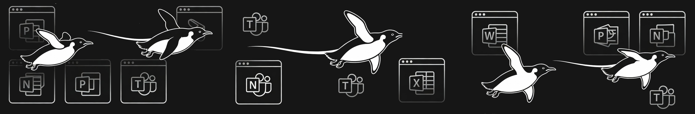
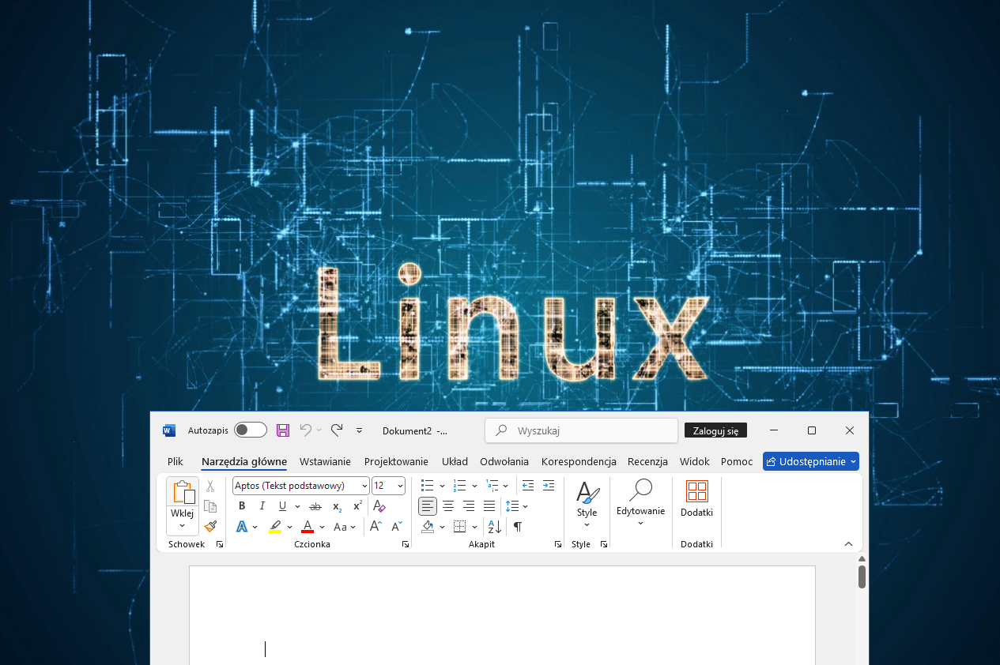

# LSW Optimizer: Extreme RAM reducer for Windows Server 2022 VMs (WinApps/RDP)

  **Lightweight Server Windows Optimizer** is a pioneering configuration matrix designed to aggressively debloat Windows Server, transforming it into an ultra-lightweight backend tailored specifically for Linux environments to create a true "Linux Subsystem for Windows". By mercilessly stripping away telemetry, background services, Windows Defender, and unnecessary UI bloat, the script reduces the operating system's idle footprint to an astonishing 200-300 MB of RAM. Ultimately, it provides a seamless and highly efficient RDP/WinApps bridge, ensuring that your wife can smoothly run the latest Microsoft Word directly on her Linux desktop, or your boss can flawlessly present a PowerPoint, all without ever realizing a virtual machine is running under the hood.
<p align="center">
  
</p>
The Ultimate Windows & Linux Bridge: If Bill Gates and Linus Torvalds can hang out together, so can Windows Server and Linux! 
*(Image source & context: [Windows Central](https://www.windowscentral.com/microsoft/bill-gates-just-met-linus-torvalds))*


> ⚠️ **SECURITY WARNING & DISCLAIMER**
> This script is a hardcore Proof-of-Concept (PoC) designed **STRICTLY for isolated, local hypervisors** running MS Office via RDP/WinApps. 
> By default, it completely disables Windows Defender, Windows Update, NLA (Network Level Authentication), and core security services. 
> **DO NOT** expose this VM to the internet. **DO NOT** use this as a daily driver for web browsing or general Windows applications. You have been warned.
>
> 🛡️ **Want to keep Defender?** The script is modular! If you prefer to maintain standard security, just remember to tick the box / skip the Defender removal option during the setup process. You are completely in control of what gets debloated!

### 💻 Getting Started
1. **Get the OS:** Download the official [Windows Server 2022 Evaluation ISO](https://info.microsoft.com/ww-landing-windows-server-2022.html) and officially become a Microsoft "homelab developer" 😉.
2. **Run the Optimizer:** Simply download the `LSW_Optimizer.cmd` file from this repository, place it on your VM's desktop, and double-click it. 

*Alternatively, open PowerShell as Administrator and paste this pro one-liner:*
```powershell
irm https://raw.githubusercontent.com/RatioFickle/LSW/main/LSW_Optimizer.cmd -OutFile LSW_Optimizer.cmd; .\LSW_Optimizer.cmd
```
## 🚀 LSW in action (Seamless Mode)
Here’s proof that extreme optimization makes sense. Native Microsoft Word 2024 (on Windows) running directly on the Ubuntu (Linux) desktop using WinApps, with minimal resource usage:



### 📝 Ultra-Light Office Installation (Zero Bloatware)
**Why use this specific configuration?** Standard Office installers choke your system with OneDrive, Teams, Skype, and heavy background sync services. The `lsw_office_config.xml` provided here is a highly optimized configuration file. It installs **only the core applications** (like Word and Excel), completely disables cloud-sync bloatware, and stops telemetry from running in the background. This step is absolutely crucial if you want to keep your VM's RAM footprint around ~300 MB.

**Installation steps:**
1. Download the official **Office Deployment Tool (ODT)** directly from the Microsoft Download Center:
   👉 [**Microsoft Download Center - Office Deployment Tool**](https://www.microsoft.com/download/details.aspx?id=49117)
2. Run the downloaded file to extract `setup.exe` into an empty folder.
3. Download the custom `lsw_office_config.xml` from this repository and place it in the exact same folder as the `setup.exe`.
4. Open the command prompt in that folder and run the lightweight deployment:
   `setup.exe /configure lsw_office_config.xml`
   
### ⚖️ Licensing & Homelab Testing
This project focuses exclusively on the extreme optimization of a virtual environment. It relies on the official evaluation versions provided by Microsoft:
* **Windows Server 2022 Evaluation** gives you a fully legal **180 days** to test the infrastructure *(with the possibility of extending the 180-day period up to 6 times, giving you nearly 3 years of testing)*.
* **Office Suite (Volume/LTSC)** offers a standard, free Grace Period immediately after installation (x3).

**How to test this environment long-term?**
The recommended engineering practice for test environments (Proof of Concept) is to create a so-called "Golden Snapshot" in your hypervisor (Proxmox/VirtualBox) immediately after finishing the installation and WinApps configuration. When the evaluation period ends, you simply restore the machine to this clean, initial state and continue testing. This is a standard and fully legal workflow in homelabs.

If, after successful testing, you decide to move this environment into daily "production" – simply enter your legal product key in the settings and forget about snapshots!

### 🤝 Credits & Acknowledgements
* **MemReduct:** This script utilizes the excellent [MemReduct by henrypp](https://github.com/henrypp/memreduct) for aggressive memory management.

### 🧰 Recommended Tools & Guides (For Beginners)
If you are just starting your homelab journey and want to build this setup from scratch, here are the essential tools and official guides you will need:

* **Virtual Machine Managers (Hypervisors):**
    * [Virtual Machine Manager (KVM/libvirt)](https://virt-manager.org/) - The native, lightning-fast hypervisor built right into the Linux kernel. **Highly recommended** as WinApps can automatically start/stop libvirt VMs!
    * [GNOME Boxes](https://apps.gnome.org/Boxes/) - The simplest, out-of-the-box VM manager often available by default on distros like Zorin OS or Ubuntu.
    * [Proxmox VE](https://www.proxmox.com/) - The industry standard for dedicated, bare-metal homelab servers.
    * [Oracle VirtualBox](https://www.virtualbox.org/) - Very easy to use if you are coming from a Windows host background.

* **Linux Integration (Seamless Mode):**
    * [WinApps Official Repository](https://github.com/winapps-org/winapps) - Step-by-step instructions on how to integrate Windows apps directly into your Linux app menu.

* **RDP Clients (Remote Desktop):**
    * [Remmina](https://remmina.org/) - A fantastic, user-friendly GUI client. Highly recommended if you just want to easily access the full Windows desktop!
    * [FreeRDP](https://www.freerdp.com/) - The powerful, command-line driven backend (required if you plan to use WinApps).
 

