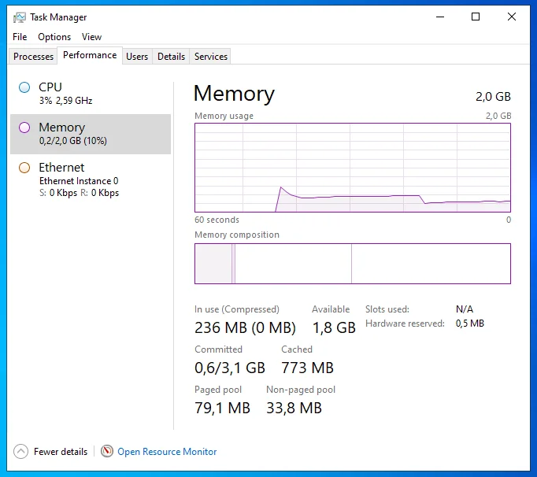
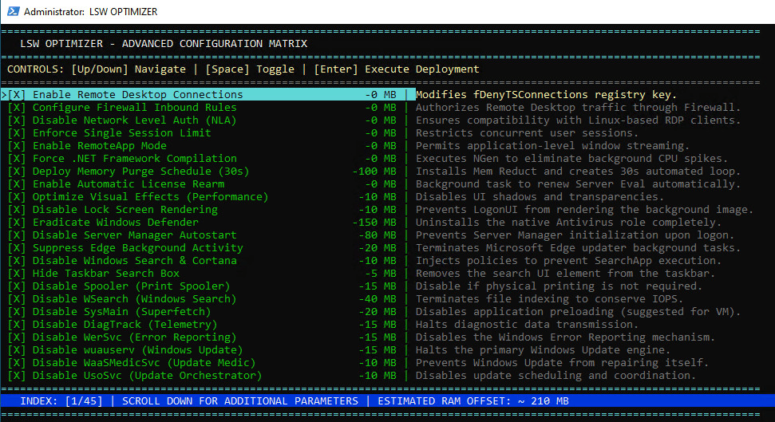

# LSW Optimizer

**Lightweight Server Windows (LSW) Optimizer** is a configuration script designed to minimize Windows Server 2022 resource usage. By stripping away telemetry, non-essential services, and UI bloat, it drops the idle RAM footprint to just 200–300 MB. 

<p align="center">
  
</p>

The goal is to create a true "Linux Subsystem for Windows"—an ultra-lean, invisible backend tailored for Linux-based RDP/WinApps environments, allowing you to run native Windows apps seamlessly on your Linux desktop without feeling the weight of a virtual machine.

<p align="center">
  
</p>
<p align="center"><i>If Bill and Linus can get along, so can Windows and Linux. (Image: <a href="https://www.windowscentral.com/microsoft/bill-gates-just-met-linus-torvalds">Windows Central</a>)</i></p>

## Configuration Options

The script is fully modular and interactive. You can precisely choose which components to optimize or remove based on your needs:



## Quick Start

1. **Obtain the OS:** Download the official [Windows Server 2022 Evaluation ISO](https://info.microsoft.com/ww-landing-windows-server-2022.html) and officially become a Microsoft "homelab/dev" 😉.
2. **Run the Optimizer:** Download `LSW_Optimizer.cmd` to your VM's desktop and execute it, or run this one-liner via PowerShell (Admin):

```powershell
irm https://raw.githubusercontent.com/RatioFickle/LSW/main/LSW_Optimizer.cmd -OutFile LSW_Optimizer.cmd; .\LSW_Optimizer.cmd
```

> ⚠️ **Security Notice & Disclaimer** > This script is a Proof-of-Concept (PoC) intended **strictly for isolated, local hypervisors** running MS Office via RDP/WinApps.
>
>   - It disables Windows Defender, Windows Update, and Network Level Authentication (NLA) by default.
>   - **DO NOT** expose this VM to public networks.
>   - **DO NOT** use this as a daily driver for web browsing.
>
> 🔐 **Modular design:** Want to keep Defender? You are completely in control. Just skip the security removal options during execution.

## LSW in Action (Seamless Mode)

Here’s proof that extreme optimization pays off. Native Microsoft Word 2024 running via WinApps directly on an Ubuntu desktop, backed by the LSW-optimized server:


## Ultra-Light Office Deployment

Standard Office installers choke your system with OneDrive, Teams, and heavy background sync services. The provided `lsw_office_config.xml` installs **only core applications** (Word, Excel) and disables telemetry. This is crucial for keeping that ~300 MB RAM footprint.

### Installation Steps

1.  Download the [Office Deployment Tool (ODT)](https://www.microsoft.com/download/details.aspx?id=49117) directly from Microsoft.
2.  Extract `setup.exe` to a new, empty folder.
3.  Place the custom `lsw_office_config.xml` from this repository in the exact same folder.
4.  Open the command prompt in that folder and run the deployment:
    ```cmd
    setup.exe /configure lsw_office_config.xml
    ```

## Licensing & Homelab Testing

This project relies on official evaluation software from Microsoft:

  * **Windows Server 2022 Evaluation**: 180-day license, rearmable up to 6 times (giving you nearly 3 years of testing).
  * **Office Suite (LTSC/Volume)**: Includes a standard grace period for evaluation.

### Long-term Testing Strategy

The recommended engineering practice for homelab test environments is to create a "Golden Snapshot" in your hypervisor immediately after finishing the installation and WinApps configuration. When the evaluation expires, simply restore the machine to this clean state.

If you decide to move this environment into daily "production," just apply a valid license key and forget about snapshots.

## Dependencies

  * **MemReduct:** This script utilizes the excellent [MemReduct by henrypp](https://github.com/henrypp/memreduct) for aggressive, real-time memory management.

## Recommended Tools & Guides (For Beginners)

If you are building this setup from scratch, here is the essential stack:

### Hypervisors

| Tool | Link | Notes |
|------|------|-------|
| Virtual Machine Manager (KVM/libvirt) | [virt-manager.org](https://virt-manager.org/) | **Highly recommended.** Native Linux integration; WinApps can auto-start/stop libvirt VMs! |
| GNOME Boxes | [apps.gnome.org/Boxes](https://apps.gnome.org/Boxes/) | Simple GUI, often preinstalled on distros like Ubuntu/Zorin. |
| Proxmox VE | [proxmox.com](https://www.proxmox.com/) | The industry standard for dedicated bare-metal homelabs. |
| Oracle VirtualBox | [virtualbox.org](https://www.virtualbox.org/) | Cross-platform and beginner-friendly. |

### Linux Integration

  * **[WinApps Official Repository](https://github.com/winapps-org/winapps)** – Step-by-step instructions for integrating Windows apps into your Linux app menu.

### RDP Clients

| Client | Link | Use Case |
|--------|------|----------|
| Remmina | [remmina.org](https://remmina.org/) | Fantastic GUI client if you just want full Windows desktop access. |
| FreeRDP | [freerdp.com](https://www.freerdp.com/) | Powerful CLI backend (**required** if you plan to use WinApps). |
